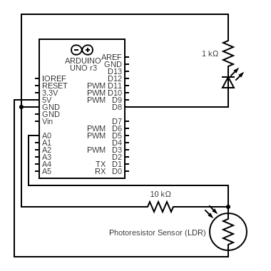

# Emergency Lamp Prototype
This is a prototype, all components or codes could change in the future.

## Hardware Required:
* Arduino UNO R3
* Breadboard
* Jumper Wire
* Photoresistor Sensors LDR
* LED
* 1k ohm resistor 1pcs
* 10k ohm resistor 1pcs

## Wiring Scheme

  
  
